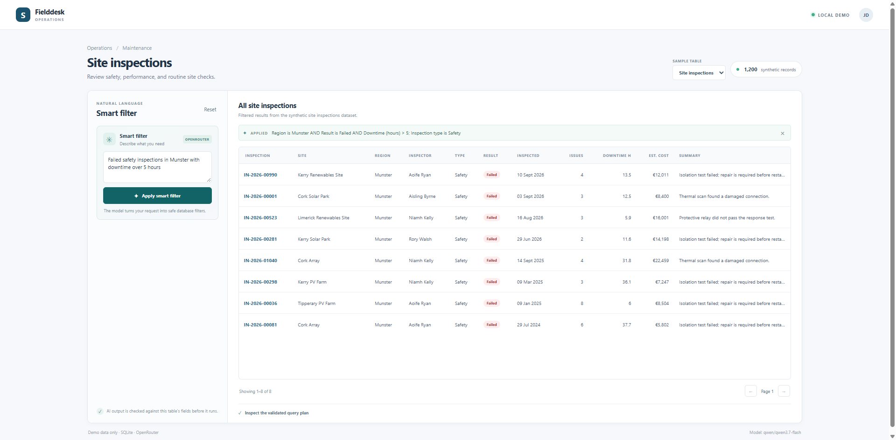
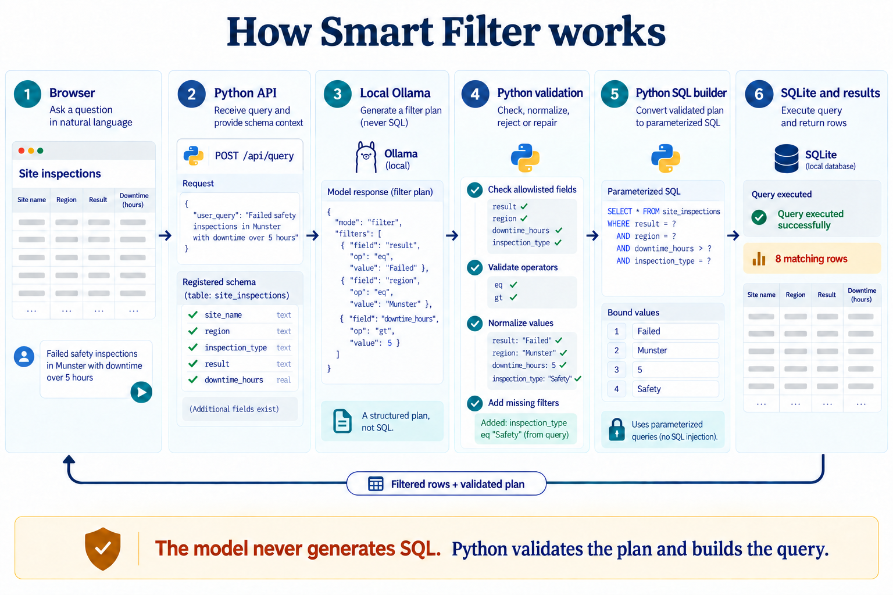

# Smart Filter Demo



> Filter tables using plain English. A local LLM proposes JSON filters; Python validates them and builds the SQLite query. The model never generates SQL.

The demo includes two fictional, repeatable datasets:

- **Work orders** — 2,500 solar maintenance jobs.
- **Site inspections** — 1,200 checks with results, findings, downtime, and estimated cost.

## Run locally

You need Python 3.10 or later and [Ollama](https://ollama.com/) installed and running. The app uses Python's standard library; no `pip install` step is needed.

In PowerShell, from the project folder:

```powershell
Copy-Item .env.example .env
ollama pull qwen2.5-coder:1.5b
python seed.py
python app.py
```

Open <http://127.0.0.1:8000>. The SQLite file is included. `python seed.py` fills in a missing or empty sample table. Use `python seed.py --force` to replace both tables with fresh copies of the same deterministic data.

Run the category-normalization regression tests with:

```powershell
python -m unittest discover -s tests
```

### Choose another Ollama model

`qwen2.5-coder:1.5b` is the default, not a requirement. You can use another Ollama chat, instruction, or coding model with similar or greater ability to follow instructions and return JSON. Larger models often need more memory and can respond more slowly. Filter plans can vary by model, so choose one that follows the supplied schema reliably.

Pull the model, then set its exact Ollama tag in `.env`:

```powershell
ollama pull <model-tag>
```

```dotenv
OLLAMA_MODEL=<model-tag>
```

This app calls Ollama's OpenAI-compatible `/v1/chat/completions` endpoint and requests JSON mode. See [Ollama's API compatibility guide](https://github.com/ollama/ollama/blob/main/docs/api/openai-compatibility.mdx). You can also change the endpoint or timeout in `.env.example` settings: `OLLAMA_BASE_URL` and `OLLAMA_TIMEOUT_SECONDS`.

## How a smart filter works



The model receives only the selected table's field names, labels, types, short descriptions, synonyms, and sample values for some text fields. For example, `downtime_hours` is described as "Hours of downtime recorded for the inspection." The descriptions explain each field's meaning and units; they do not change which fields are allowed. The model does not receive database credentials or SQL tools. Python accepts only registered table and column names; filter values are passed to SQLite separately as parameters.

## What is in a filter plan?

A plan is JSON data, not executable code. It describes conditions, sort order, and an optional row limit. Conditions can be nested with `and` and `or`. For example:

```json
{
  "mode": "filter",
  "filters": [
    {"and": [
      {"field": "result", "op": "eq", "value": "Failed"},
      {"field": "downtime_hours", "op": "gt", "value": 5}
    ]}
  ],
  "sort": [],
  "limit": null,
  "applied_filter_text": "Failed inspections with over 5 hours downtime"
}
```

Available operators depend on the field type:

- **Text:** `eq`, `neq`, `contains`, `not_contains`, `in`, `is_null`, `is_not_null`.
- **Number:** `eq`, `neq`, `gt`, `gte`, `lt`, `lte`, `between`, `in`, `is_null`, `is_not_null`.
- **Date:** `eq`, `neq`, `gt`, `gte`, `lt`, `lte`, `between`, `is_null`, `is_not_null`.
- **Searchable text:** `_text` searches fields marked `search: True`; it supports `contains` and `not_contains`.

The server also checks group depth, value types, date format, sort fields, and limits before it builds a query. Text and numeric values never become SQL syntax.

## Add your own table

The two datasets use one shared planner, validator, SQL compiler, API, and results table. To add another sample table:

1. **Create its schema and seed data** in `seed.py`. Use stable sample data so examples are repeatable. Add the table to `create_schema()` and insert rows from `seed_database()`.
2. **Describe its fields** in `app.py`. Each field's `name` must match a SQLite column. Give it a readable `label`, a short `description` of what its values mean, and a `kind`: `text`, `number`, or `date`. Include units in the description where useful. Set `search: True` when that text column should be included in full-text search. Add useful `synonyms` for the model.
3. **Register the dataset** in `DATASETS` with its table name, fields, field map, ID field, date field, prompt example, and display `columns`. The display columns define the results table headings and formats.
4. **Add optional language hints** when the model needs help with your categories, relative dates, or common sort phrases. See `INSPECTION_CATEGORY_PATTERNS`, `relative_opened_date_hint()`, and `rank_hints()` for examples.
5. **Add a prompt example** and a natural-language example to this README. Run `python seed.py`, then start the app and try the example.

The browser builds its table selector and column headings from `/api/meta`. The common filter operators work automatically for registered fields; custom SQL generation is not needed.

## Reuse with an existing database or ORM

The solar datasets and phrase patterns make this demo easy to try, but the central contract is broader: give the model an allowlisted field schema, validate its JSON plan, then translate that plan into a query. Short field descriptions help the model understand a new domain without adding a special prompt rule for every column.

The current database adapter is SQLite-specific. `schema_for_prompt()` reads sample text values from SQLite, while `compile_expression()` and `execute_query()` build and run parameterized SQLite queries. For an ORM such as SQLAlchemy or Django ORM, keep the JSON plan and field validation, then replace those database-facing parts: get sample values from your data layer (or omit them), map allowed field names to model attributes, recursively translate validated `and`/`or` groups and operators into ORM expressions, and apply validated sorting and limits. Keep application access rules, such as tenant or user scoping, outside the model's plan.

`CATEGORY_PATTERNS`, `rank_hints()`, and the relative-date helpers are optional corrections for phrases in these sample datasets. Change or remove them for another domain. An ORM adapter is not included in this demo; adding an ORM requires implementing and checking that translation layer.

## Limitations

- The included records are synthetic demo data, and queries require a local Ollama model.
- Model interpretations can vary. Review the validated plan and results when query meaning matters.
- This demo has not been hardened or evaluated for production use.

## API and code map

- `GET /api/meta` — dataset names, record counts, result columns, and active model name.
- `POST /api/query` — accepts `dataset`, `smart_query`, `page`, `page_size`, and an optional validated plan for pagination.
- `GET /api/health` — simple local health response.

Main files:

- `app.py` — dataset registry, Ollama prompts, plan parsing and validation, query compiler, and HTTP API.
- `seed.py` — SQLite schemas and deterministic sample-data generators.
- `static/index.html` — page structure and controls.
- `static/app.js` — API requests, dataset switching, and table rendering.
- `static/styles.css` — page styling.
- `tests/test_category_normalization.py` — category negation regression tests.
- `data/work_orders.sqlite3` — included SQLite database with both tables.
- `scripts/test_ollama.py` — optional integration check; it sends real requests to the configured local Ollama model.

## License

Released under the [MIT License](LICENSE).

Follow [Kanish R on X](https://x.com/r_kanish39522) for development updates.
